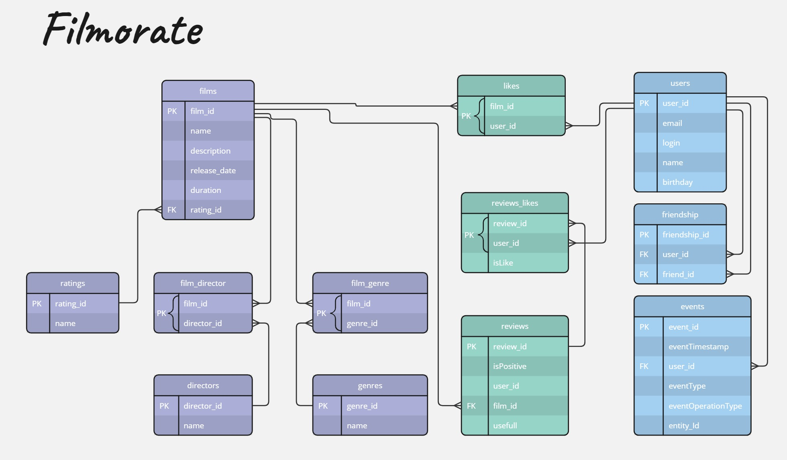

# java-filmorate
Template repository for Filmorate project.  
## Диаграмма "Сущность связь" (ER-diagramm)

[Ссылка на ER - диаграмму проекта Filmorate на ресурсе Miro](https://miro.com/welcomeonboard/MkpPbkM2Z1NOckt0TDlycXNHaFFab0xmTUtVYmpKMzdwRktHWnRKeWN5TUlIUVRFc28yaWZzTXpUY0dremRGWHwzNDU4NzY0NTU3NDQxMjc4NzQ0fDI=?share_link_id=408133644286)

## Примеры запросов к таблицам
* Выгрузка всех строк и полей из таблицы **film**: ```SELECT * FROM film;```
* Выгрузка всех строк и полей из таблицы **user**: ```SELECT * FROM user;``` 
* Получение списка жанров конкретного фильма: <br> 
```SELECT name FROM genre``` <br>
```WHERE genre_id IN (SELECT genre_id``` <br> 
```FROM film_genre WHERE film_id = <id>)```
* Получение списка друзей конкретного ползователя: <br>
```SELECT name FROM user``` <br>
```WHERE user_id IN (SELECT friend_id``` <br>
```FROM friends WHERE user_id = <id>)```

